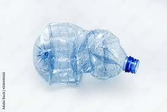
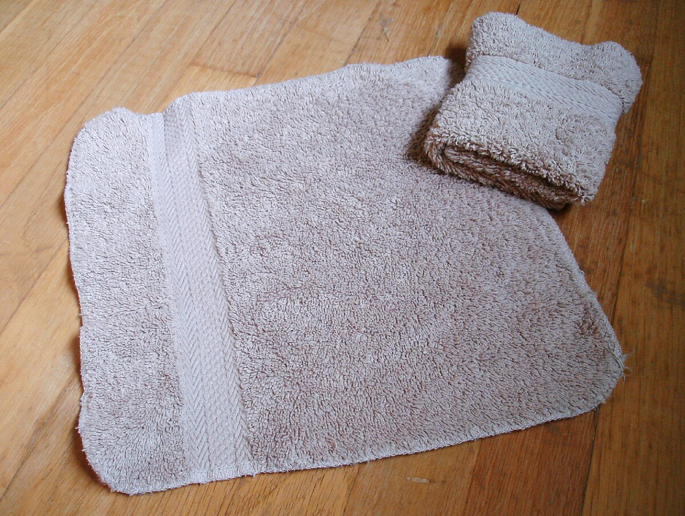
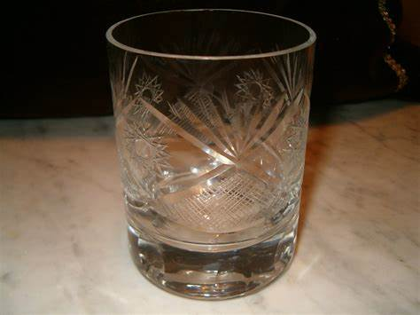

# Garbage Classification

## Introduction
This project is a simple image classification project that classifies images of garbage into different classes of household waste. 

## Dataset
The dataset used for this project is the [Garbage Classification dataset](https://www.kaggle.com/mostafaabla/garbage-classification) from Kaggle. The dataset contains 12 classes of garbage images. The classes are:
1. battery 
2. biological 
3. brown-glass 
4. cardboard 
5. clothes 
6. green-glass 
7. metal 
8. paper 
9. plastic 
10. shoes 
11. trash 
12. white-glass

## Model
The model used for this project has [EfficientNet](https://arxiv.org/abs/2104.00298) as the backbone, following by a fully connected layer.

## Usage
To use this project, you need to have Python 3 installed. A virtual environment is recommended to manage your Python packages.


### Setup

#### Install the required packages
To install the required packages, run the following command:

```pip install -r requirements.txt```

If you also want to use the jupyter notebook, you need to install the corresponding requirements with the following command:

```pip install -r notebook_requirements.txt```

#### Download the dataset
Download the dataset using the script below:
```python -m scripts.download_dataset```.
The script will ask you to provide your Kaggle username and Kaggle API key. You can get your Kaggle API key by following the instructions [here](https://www.kaggle.com/docs/api#authentication).


### Running the scripts
To use the repository, you can either train the model or use a pre-trained model. You can find on [this link](https://drive.google.com/file/d/1-1Z). (Note: the pretrained should be placed in the 'checkpoints' folder.)

#### Training
To train the model, run the following command:

```python -m scripts.train```

#### Testing
To test the model, run the following command:

```python -m scripts.eval```

#### Predicting
To predict the class of an image, run the following command:

```python -m scripts.predict --image_path path/to/image```

### Visualizing the results
You can observe some results for the following images:

| paper                       | plastic-bottle                          | wash-clot                        | white-glass                        |
|-------------------------------|-----------------------------------------|------------------------------------|--------------------------------------|
|  |  |  |  |

For that, just run the following command:

```python -m scripts.visualize_results```

You should see the following output:

```
Image 1/4
         Image: paper
         Prediction: paper
         Confidence: 0.999967634677887
         Class probabilities: [0.00 0.00 0.00 0.00 0.00 0.00 0.00 1.00 0.00 0.00 0.00 0.00]
Image 2/4
         Image: wash-cloth
         Prediction: clothes
         Confidence: 1.0
         Class probabilities: [0.00 0.00 0.00 0.00 1.00 0.00 0.00 0.00 0.00 0.00 0.00 0.00]
Image 3/4
         Image: white-glass
         Prediction: white-glass
         Confidence: 1.0
         Class probabilities: [0.00 0.00 0.00 0.00 0.00 0.00 0.00 0.00 0.00 0.00 0.00 1.00]
Image 4/4
         Image: plastic-bottle
         Prediction: plastic
         Confidence: 1.0
         Class probabilities: [0.00 0.00 0.00 0.00 0.00 0.00 0.00 0.00 1.00 0.00 0.00 0.00]
```

## License
This project is licensed under the MIT License - see the [LICENSE](LICENSE) file for details.


